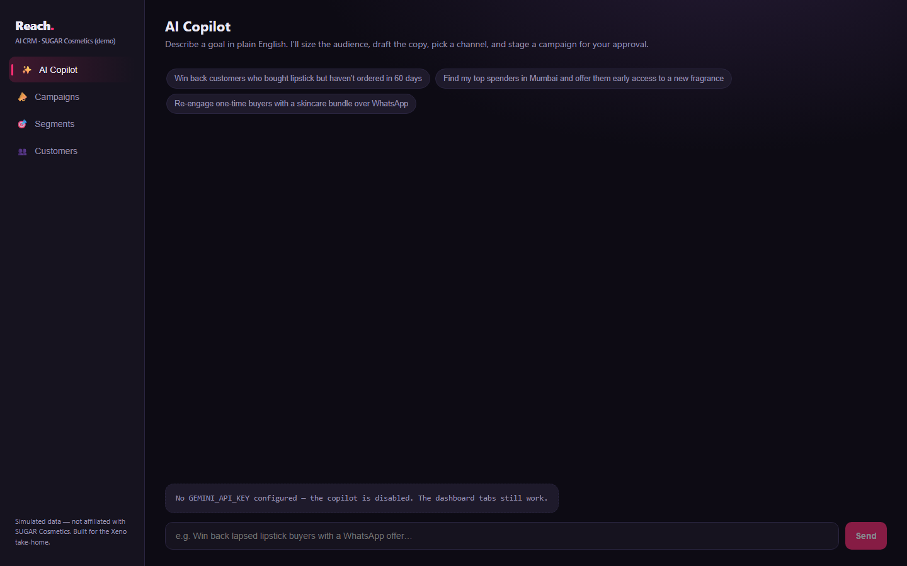
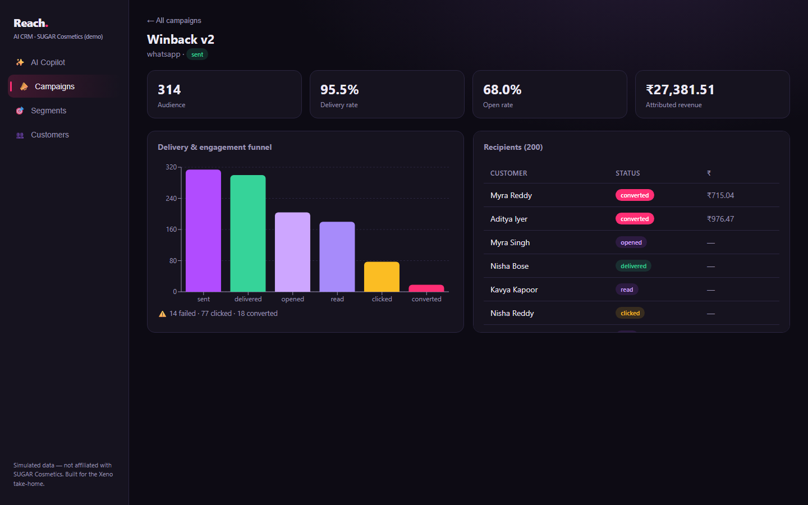

# Reach — an AI-native Mini CRM for reaching shoppers

> Built for the Xeno engineering take-home. **Reach** lets a beauty brand's marketer
> describe a goal in plain English and have an AI copilot turn it into a launched,
> tracked campaign — sizing the audience, drafting the copy, picking the channel,
> and surfacing live performance.
>
> Brand persona: **SUGAR Cosmetics** (a D2C beauty brand). All data is **simulated**;
> this is an unofficial demo and is **not affiliated with SUGAR Cosmetics**.

- **Live app:** _<add Vercel URL>_
- **CRM API:** _<add Render URL>_ · **Channel service:** _<add Render URL>_
- **Walkthrough video:** _<add link>_

| AI Copilot (chat-first) | Live campaign funnel |
|---|---|
|  |  |

---

## 1. The product bet

The brief is deliberately open, so the sharpest thing to do is **commit to one point of
view**. Reach's bet: **the marketer talks to an agent, not a form.**

> _"Win back customers who bought lipstick but haven't ordered in 60 days."_

The agent (Google Gemini, tool-use loop) responds by actually doing the work:

1. **Sizes the audience** — translates the goal into a structured filter and previews the count.
2. **Drafts the copy** — on-brand, personalized (`{{name}}`, `{{city}}`, `{{last_item}}`).
3. **Recommends a channel** — WhatsApp / SMS / Email / RCS, with a reason.
4. **Stages a campaign as a draft** — and hands control back to the human.
5. The marketer clicks **Approve & Launch**; from there Reach tracks the full
   delivery + engagement funnel **live**.

A classic dashboard (Campaigns, Segments, Customers) sits alongside the chat so nothing
is a black box — every audience and campaign the agent creates is inspectable.

**What I deliberately did _not_ build:** sales/pipeline/leads/tickets, real messaging
providers, auth/multi-tenancy, A/B testing, migrations tooling. Each is a conscious cut
to keep the surface sharp (see §7).

---

## 2. Architecture

```
                ┌─────────────────────────────────────────────┐
                │                Browser (React)               │
                │   AI Copilot · Campaigns · Segments · Cust.  │
                └───────────────┬─────────────────────────────┘
                                │ REST + polling
                                ▼
   ┌──────────────────────────────────────────────────────────────┐
   │                      CRM service (FastAPI)                     │
   │                                                                │
   │   /agent/chat ── Gemini tool-use loop ── tools:                │
   │        preview_audience · create_segment · stage_campaign      │
   │        get_campaign_performance                                │
   │                                                                │
   │   Segmentation:  Filter DSL ──► SQLAlchemy query               │
   │   Launch:        materialise Communications ──► dispatch ──────┼──┐
   │   /webhooks/receipts ◄── idempotent, order-independent ingest  │  │ HMAC-signed
   │   Analytics:     funnel + attributed revenue                   │  │ send batch
   └───────────────────────────┬────────────────────────────────────┘  │
                                │ Postgres (prod) / SQLite (local)       │
                                ▼                                        ▼
                       ┌────────────────┐         ┌──────────────────────────────────┐
                       │   Postgres     │         │   Channel service (FastAPI)        │
                       └────────────────┘         │                                    │
                                                  │   intake queue → worker pool       │
        HMAC-signed callbacks  ◄──────────────────┤   probabilistic lifecycle sim      │
        (delivered/opened/read/                    │   out-of-order + duplicate events  │
         clicked/converted/failed)                 │   retry w/ exponential backoff     │
                                                  └──────────────────────────────────┘
```

Two independently deployable services + a frontend, in one repo:

| Path              | What it is                                                                 |
|-------------------|----------------------------------------------------------------------------|
| `crm/`            | The product. Ingestion, segmentation, the agent, launch, webhook ingest, analytics. |
| `channel-service/`| A **stub** of a messaging provider. Delivers nothing real — it *simulates* the lifecycle and calls back. |
| `web/`            | React + Vite + TypeScript dashboard & chat.                                |

---

## 3. The two things I'd want you to read first

These are the most logic-dense, most-defensible parts of the codebase.

### a) Segmentation: a Filter DSL, not LLM-generated SQL
[`crm/app/segmentation/dsl.py`](crm/app/segmentation/dsl.py)

The agent never writes SQL. It emits a small declarative filter that Pydantic validates
against a **whitelist of fields and operators**, which is then compiled to a parameterised
SQLAlchemy query:

```json
{ "match": "all",
  "conditions": [
    { "field": "last_order_days_ago", "op": "gt", "value": 60 },
    { "field": "category", "op": "in", "value": ["lipstick"] } ] }
```

Why this shape: **no injection, no hallucinated columns, and portability** — relative-date
conditions ("ordered > 60 days ago") are translated into absolute timestamp cutoffs in
Python, so the identical DSL runs on SQLite (local/tests) and Postgres (prod) with no
dialect-specific date math.

### b) Webhook ingestion: idempotent and order-independent
[`crm/app/services/receipts.py`](crm/app/services/receipts.py) · [`crm/app/models.py`](crm/app/models.py)

A communication's **status is _derived_ from which lifecycle timestamps are set**
(`converted > clicked > read > opened > delivered > sent`), not stored as mutable state.
Combined with a `UNIQUE event_id`, this gives three properties the brief explicitly probes:

- **Exactly-once** — a retried/duplicate callback is recorded once; the rest are no-ops.
- **Order-independent** — a `read` arriving before `delivered` still yields a correct funnel.
- **No double-counted revenue** — conversion value is attributed once, guarded by the same dedupe.

The channel service deliberately **injects ~5% duplicate callbacks and dispatches every
event on an independent jittered timer** (so callbacks arrive out of order) precisely to
exercise these guarantees. Covered by [`crm/tests/test_receipts.py`](crm/tests/test_receipts.py).

---

## 4. The callback loop (channel service)

[`channel-service/app/worker.py`](channel-service/app/worker.py) · [`simulator.py`](channel-service/app/simulator.py)

The send/receipt loop is modelled close to how real channel delivery works:

1. CRM `POST /v1/send` with an **HMAC-signed** batch → channel service returns `202` immediately.
2. A **bounded intake queue + worker pool** drains the batch; each communication's lifecycle
   runs as its own task. The queue is the backpressure point.
3. A separate **semaphore caps concurrent outbound callbacks** — the genuinely constrained
   resource (HTTP connections to the CRM) — so a worker is never held hostage for a message's
   multi-second lifecycle. Intake therefore stays fast under load.
4. Each event posts back to `/webhooks/receipts` with HMAC + **retry/exponential backoff**, so
   a transiently-down CRM doesn't lose events.

This separation — _intake concurrency_ vs _outbound rate_ — is the deliberate design choice.
At scale the queue becomes SQS/Kafka and the workers a horizontally-scaled consumer group;
the shape is unchanged (see §7).

---

## 5. AI-native design

- **Agent loop:** [`crm/app/llm/agent.py`](crm/app/llm/agent.py) runs a bounded
  (`MAX_STEPS`) model→tools→model loop. Tools are the *only* way the model touches the CRM
  ([`llm/tools.py`](crm/app/llm/tools.py)).
- **Provider-agnostic:** [`crm/app/llm/provider.py`](crm/app/llm/provider.py) defines a
  normalized interface; `GeminiProvider` is the default (`gemini-2.5-flash`). Swapping to
  Groq/OpenAI is one more class — the orchestration never changes.
- **Human-in-the-loop by construction:** there is **no `launch` tool**. The agent can only
  stage a `draft`; a human must approve the send in the UI. Safety isn't a prompt, it's the API surface.
- **Graceful degradation:** if no `GEMINI_API_KEY` is set, the chat disables itself and the
  whole dashboard still works — a free-tier rate limit can't break a demo.

> _AI-native workflow:_ this project itself was built with an AI coding agent — used to
> scaffold the services, generate the Filter-DSL compiler and the idempotent receipt handler,
> and write the test suite — with each piece reviewed, run, and corrected against real output
> (e.g. the worker was refactored after the first version blocked throughput). See the video.

---

## 6. Running it locally

**Prerequisites:** Python 3.12, Node 20+. (Docker optional.)

```bash
# 1) Channel service  (terminal A)
cd channel-service && python -m venv .venv && .venv/Scripts/pip install -r requirements.txt
.venv/Scripts/uvicorn app.main:app --port 8001

# 2) CRM  (terminal B) — defaults to SQLite, no DB setup needed
cd crm && python -m venv .venv && .venv/Scripts/pip install -r requirements.txt
copy .env.example .env          # then add your GEMINI_API_KEY for the chat
.venv/Scripts/python -m app.seed          # ~1,000 customers + ~5,000 orders
.venv/Scripts/uvicorn app.main:app --port 8000

# 3) Frontend  (terminal C)
cd web && npm install && npm run dev       # http://localhost:5173
```

Get a free Gemini key at https://aistudio.google.com/apikey and put it in `crm/.env`.

**Or with Docker** (Postgres + both services): `docker compose up --build`, then
`docker compose exec crm python -m app.seed`.

**Tests:** `cd crm && .venv/Scripts/python -m pytest`  (DSL translation + webhook idempotency).

---

## 7. Scale assumptions & conscious tradeoffs

| Decision (this scope)                     | At real scale                                            |
|-------------------------------------------|----------------------------------------------------------|
| In-process asyncio queue + worker pool    | SQS/Kafka + a horizontally-scaled consumer group         |
| Polling for live UI                       | SSE / WebSockets pushed from the CRM                      |
| `create_all` schema                       | Alembic migrations                                       |
| SQLite local / single Postgres prod       | Postgres with read replicas; partition `communications`  |
| Synchronous launch (materialise + POST)   | Background job; chunked dispatch with rate limits        |
| Whole-history-per-turn agent context      | Summarised memory + retrieval over past campaigns        |
| Single shared HMAC secret                 | Per-tenant keys + rotation                               |

Assumed scale for this build: thousands of customers, campaigns of a few hundred–thousand
recipients, callbacks playing out in seconds. The code is structured so the *shapes*
(queue, idempotent ingest, derived state) survive the jump; the *infrastructure* is what changes.

---

## 8. Tech stack

**Backend:** FastAPI · SQLAlchemy 2 (async) · Pydantic · httpx · Postgres/SQLite ·
google-genai (Gemini 2.5 Flash) · pytest.
**Frontend:** React 18 · Vite · TypeScript · Recharts.
**Deploy:** Vercel (web) · Render (both services + Postgres).
